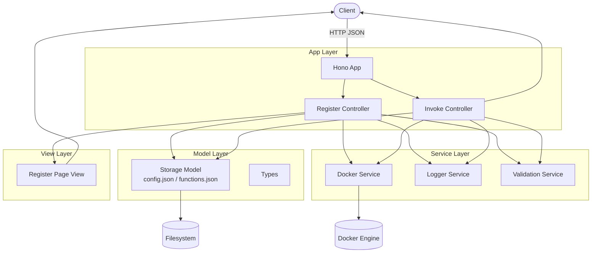

# Architecture

```mermaid
flowchart TB
  client([Client]) -->|HTTP JSON| app[Hono App]

  subgraph App Layer
    app --> regCtrl[Register Controller]
    app --> invokeCtrl[Invoke Controller]
  end

  subgraph Model Layer
    storage[Storage Model
config.json / functions.json]
    types[Types]
  end

  subgraph Service Layer
    dockerSvc[Docker Service]
    loggerSvc[Logger Service]
    validationSvc[Validation Service]
  end

  subgraph View Layer
    registerView[Register Page View]
  end

  regCtrl --> validationSvc
  regCtrl --> storage
  regCtrl --> dockerSvc
  regCtrl --> loggerSvc
  regCtrl --> registerView

  invokeCtrl --> validationSvc
  invokeCtrl --> storage
  invokeCtrl --> dockerSvc
  invokeCtrl --> loggerSvc

  dockerSvc --> docker[(Docker Engine)]
  storage --> files[(Filesystem)]
  registerView --> client
  invokeCtrl --> client
```
