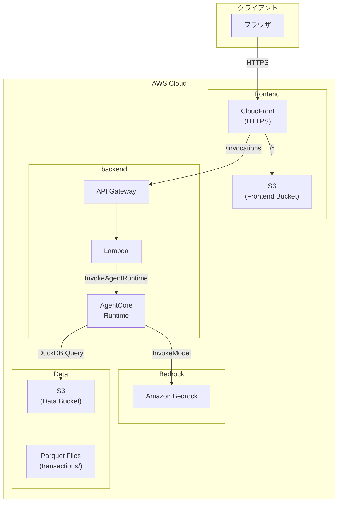
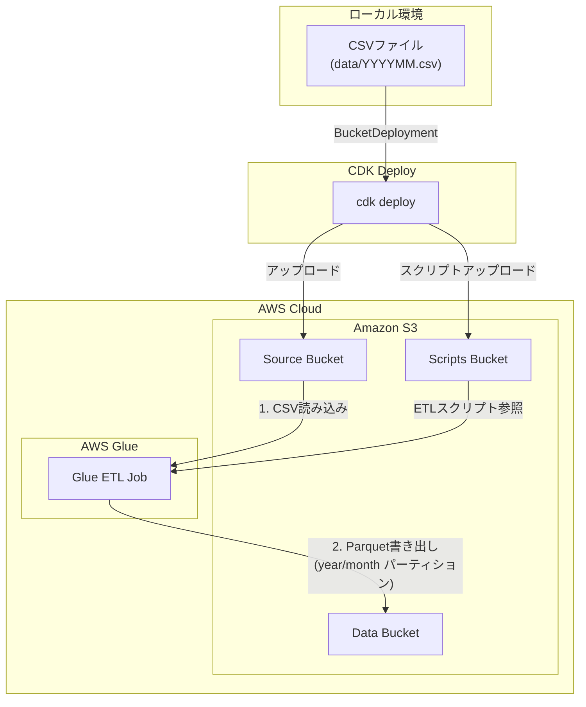
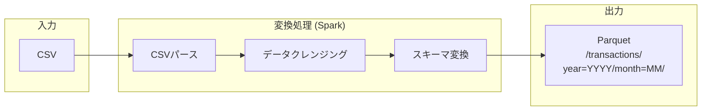

# Household Accounting Analysis Agent

家計簿データを分析するAIエージェントシステム

## システム構成図

### アプリケーション構成



### CSV → Parquet 変換フロー



### ETL処理詳細



### データスキーマ

| 入力 (CSV) | 出力 (Parquet) | 型 |
|-----------|---------------|-----|
| 日付 (MM/DD(曜日)) | date | DATE |
| 内容 | description | STRING |
| 金額（円） | amount | INT |
| 保有金融機関 | financial_institution | STRING |
| 大項目 | major_category | STRING |
| 中項目 | minor_category | STRING |
| メモ | memo | STRING |
| - | year | INT (パーティション) |
| - | month | INT (パーティション) |

## Glue Job 実行方法

```bash
# 単一ファイルの処理
aws glue start-job-run \
  --job-name household-accounting-csv-to-parquet \
  --arguments '{"--SOURCE_KEY":"202501.csv"}'
```
