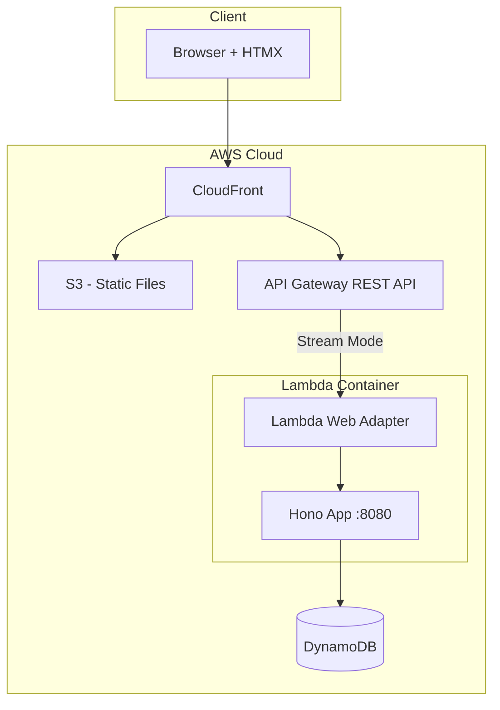

# Design Document: Hono Lambda Rewrite

## Overview

This design describes the architecture for rewriting the existing Lambda functions into a single Hono-based application deployed with Lambda Web Adapter. The solution consolidates the `increment` and `sse` Lambda functions into one portable web application that supports 15-minute response streaming via API Gateway REST API.

## Architecture



### Key Architecture Decisions

1. **Single Container Lambda**: Consolidate two Lambda functions into one Hono application for simpler deployment and maintenance
2. **Lambda Web Adapter**: Use AWS Lambda Web Adapter to run standard Node.js web server without Lambda-specific code
3. **Response Streaming**: Configure `AWS_LWA_INVOKE_MODE=response_stream` for SSE support up to 15 minutes
4. **Distroless Runtime**: Use `gcr.io/distroless/nodejs24-debian12` for minimal attack surface

## Components and Interfaces

### Directory Structure

```
src/
└── hono-app/
    ├── Dockerfile
    ├── package.json
    ├── tsconfig.json
    └── src/
        ├── index.ts          # Hono app entry point
        ├── routes/
        │   ├── increment.ts  # POST /api/increment handler
        │   └── events.ts     # GET /api/events SSE handler
        └── services/
            └── counter.ts    # DynamoDB counter operations
```

### Component: Hono App Entry Point (`index.ts`)

```typescript
// Pseudocode
import { Hono } from 'hono'
import { cors } from 'hono/cors'
import { serve } from '@hono/node-server'
import incrementRoute from './routes/increment'
import eventsRoute from './routes/events'

const app = new Hono()

app.use('/*', cors())
app.get('/', (c) => c.text('OK'))
app.route('/api', incrementRoute)
app.route('/api', eventsRoute)

serve({ fetch: app.fetch, port: 8080 })
```

### Component: Increment Route (`routes/increment.ts`)

```typescript
// Pseudocode
import { Hono } from 'hono'
import { incrementCounter } from '../services/counter'

const app = new Hono()

app.post('/increment', async (c) => {
  try {
    const count = await incrementCounter()
    return c.json({ count })
  } catch (error) {
    return c.json({ error: 'Failed to increment' }, 500)
  }
})

export default app
```

### Component: SSE Events Route (`routes/events.ts`)

```typescript
// Pseudocode
import { Hono } from 'hono'
import { streamSSE } from 'hono/streaming'
import { getCounterValue } from '../services/counter'

const POLL_INTERVAL_MS = 1000

const app = new Hono()

app.get('/events', async (c) => {
  return streamSSE(c, async (stream) => {
    let lastCount = null
    
    // Send initial value
    const initialCount = await getCounterValue()
    lastCount = initialCount
    await stream.writeSSE({
      event: 'counter',
      data: `<div id="counter">${initialCount}</div>`
    })
    
    // Poll for changes
    while (true) {
      await stream.sleep(POLL_INTERVAL_MS)
      const currentCount = await getCounterValue()
      if (currentCount !== lastCount) {
        lastCount = currentCount
        await stream.writeSSE({
          event: 'counter',
          data: `<div id="counter">${currentCount}</div>`
        })
      }
    }
  })
})

export default app
```

### Component: Counter Service (`services/counter.ts`)

```typescript
// Pseudocode
import { DynamoDBClient } from '@aws-sdk/client-dynamodb'
import { DynamoDBDocumentClient, GetCommand, UpdateCommand } from '@aws-sdk/lib-dynamodb'

const TABLE_NAME = process.env.TABLE_NAME || 'CounterTable'
const PARTITION_KEY = 'COUNTER'

const client = new DynamoDBClient({})
const docClient = DynamoDBDocumentClient.from(client)

export async function getCounterValue(): Promise<number> {
  const result = await docClient.send(new GetCommand({
    TableName: TABLE_NAME,
    Key: { pk: PARTITION_KEY }
  }))
  return result.Item?.count ?? 0
}

export async function incrementCounter(): Promise<number> {
  const result = await docClient.send(new UpdateCommand({
    TableName: TABLE_NAME,
    Key: { pk: PARTITION_KEY },
    UpdateExpression: 'ADD #count :inc SET #updatedAt = :now',
    ExpressionAttributeNames: { '#count': 'count', '#updatedAt': 'updatedAt' },
    ExpressionAttributeValues: { ':inc': 1, ':now': new Date().toISOString() },
    ReturnValues: 'ALL_NEW'
  }))
  return result.Attributes?.count ?? 0
}
```

## Data Models

### DynamoDB Counter Item

| Attribute | Type | Description |
|-----------|------|-------------|
| pk | String | Partition key, always "COUNTER" |
| count | Number | Current counter value |
| updatedAt | String | ISO 8601 timestamp of last update |

### SSE Event Format

```
event: counter
data: <div id="counter">{count}</div>

```

### Increment Response

```json
{
  "count": 42
}
```

### Error Response

```json
{
  "error": "Failed to increment counter",
  "message": "DynamoDB error details"
}
```

## Dockerfile

```dockerfile
# Build stage
FROM public.ecr.aws/docker/library/node:24-slim AS builder
WORKDIR /app
COPY package*.json ./
RUN npm ci
COPY . .
RUN npm run build

# Runtime stage
FROM gcr.io/distroless/nodejs24-debian12
COPY --from=public.ecr.aws/awsguru/aws-lambda-adapter:0.8.4 /lambda-adapter /opt/extensions/lambda-adapter
WORKDIR /app
COPY --from=builder /app/dist ./dist
COPY --from=builder /app/node_modules ./node_modules
ENV AWS_LWA_INVOKE_MODE=response_stream
ENV PORT=8080
EXPOSE 8080
CMD ["dist/index.js"]
```

## CDK Infrastructure Changes

### Lambda Function Definition

```typescript
// Pseudocode
const honoLambda = new lambda.DockerImageFunction(this, 'HonoLambda', {
  code: lambda.DockerImageCode.fromImageAsset(HONO_APP_ROOT),
  environment: {
    TABLE_NAME: counterTable.tableName,
  },
  timeout: cdk.Duration.minutes(15),
  memorySize: 256,
})
counterTable.grantReadWriteData(honoLambda)
```

### API Gateway Integration

```typescript
// Pseudocode
const honoIntegration = new apigateway.LambdaIntegration(honoLambda, {
  responseTransferMode: apigateway.ResponseTransferMode.STREAM,
})

// Route all /api/* to Hono Lambda
apiResource.addProxy({
  defaultIntegration: honoIntegration,
  anyMethod: true,
})
```


## Correctness Properties

*A property is a characteristic or behavior that should hold true across all valid executions of a system—essentially, a formal statement about what the system should do. Properties serve as the bridge between human-readable specifications and machine-verifiable correctness guarantees.*

### Property 1: Increment Atomicity and Return Value

*For any* sequence of N concurrent increment operations, the final counter value should equal the initial value plus N, and each increment call should return a value exactly 1 greater than the previous state.

**Validates: Requirements 2.1, 4.2**

### Property 2: Increment Response Format

*For any* successful increment request, the response should be valid JSON containing a `count` field with a number value, HTTP status 200, and include CORS headers (`Access-Control-Allow-Origin`).

**Validates: Requirements 2.2, 2.4**

### Property 3: SSE Event Format

*For any* counter value change, the SSE event sent should have event name "counter" and data containing an HTML fragment matching the pattern `<div id="counter">{count}</div>` where `{count}` is the numeric counter value.

**Validates: Requirements 3.1, 3.4**

### Property 4: SSE Initial Value

*For any* new SSE connection, the first event received should contain the current counter value from DynamoDB (or 0 if no record exists).

**Validates: Requirements 3.2, 4.3**

### Property 5: Counter Service Get/Set Consistency

*For any* counter state, calling `getCounterValue()` should return the same value that was last set by `incrementCounter()`, demonstrating read-after-write consistency.

**Validates: Requirements 4.1, 4.2**

## Error Handling

### Increment Handler Errors

| Error Type | HTTP Status | Response |
|------------|-------------|----------|
| DynamoDB Error | 500 | `{ "error": "Failed to increment counter", "message": "<details>" }` |
| Unknown Error | 500 | `{ "error": "Internal server error" }` |

### SSE Handler Errors

| Error Type | Behavior |
|------------|----------|
| Initial DynamoDB Error | Close stream with error event |
| Polling DynamoDB Error | Log error, continue polling |
| Stream Write Error | Log error, close stream gracefully |

### Counter Service Errors

- All DynamoDB errors are propagated to callers
- Missing records return default value (0) instead of throwing

## Testing Strategy

### Unit Tests

Unit tests will verify specific examples and edge cases:

1. **Health Check Endpoint**: Verify `GET /` returns 200 with "OK"
2. **Increment Endpoint Routing**: Verify `POST /api/increment` is routed correctly
3. **SSE Endpoint Headers**: Verify `GET /api/events` returns correct SSE headers
4. **Error Handling**: Verify 500 responses on DynamoDB errors
5. **Empty Counter**: Verify `getCounterValue()` returns 0 when no record exists

### Property-Based Tests

Property-based tests will use `fast-check` library to verify universal properties:

1. **Property 1**: Generate random sequences of increment operations and verify atomicity
2. **Property 2**: Generate random successful increments and verify response format
3. **Property 3**: Generate random counter values and verify SSE event format
4. **Property 4**: Test initial SSE connection with various counter states
5. **Property 5**: Generate random increment sequences and verify get/set consistency

Each property test should run minimum 100 iterations.

### Integration Tests

1. **End-to-End Flow**: Increment counter and verify SSE receives update
2. **CDK Snapshot Tests**: Verify infrastructure configuration matches expectations

### Test Configuration

- Framework: Vitest with `fast-check` for property-based testing
- Mocking: Use `aws-sdk-client-mock` for DynamoDB in unit tests
- Property tests: Minimum 100 iterations per property
- Tag format: `Feature: hono-lambda-rewrite, Property {N}: {description}`
